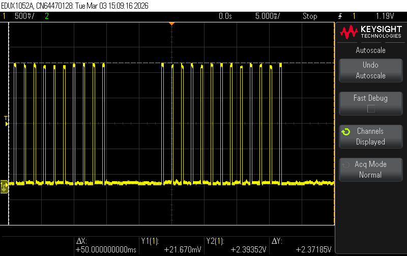

# ESC Tools (v1.0) 🛠️

A comprehensive **ESC Debugger & Signal Tool** built using Arduino. This tool provides a powerful interface for testing, calibrating, and analyzing Electronic Speed Controllers (ESCs), Servo motors, Flight computers, Stepper motors, and all PWM Interfaces, all within a compact handheld device.

## ✨ Features

- **Manual PWM Control**: Fine-tune your ESC with precise pulse width control.
- **Step Throttle**: Quickly test range with 100µs increments.
- **Auto Sweep**: Automatically ramp throttle between min/max to find startup points or test durability.
- **Signal Analyzer**: Real-time PWM reader with:
  - Pulse width (µs) and Frequency (Hz) measurement.
  - Jitter analysis and Dropped Frame tracking.
  - **Mini Logic Analyzer**: Visual waveform representation on the OLED.
- **Noisy Signal**: Simulate real-world signal issues with programmable jitter (±10µs) and dropped frames (5%) to test ESC stability.
- **ESC Calibration**: Guided step-by-step routine to calibrate new ESCs.
- **Stress Test**: High-load cycling to test ESC/Motor cooling and stability.
- **PPM Generator**: 12-channel PPM signal generation for flight controller testing.
- **PPM Reader**: PPM channels reader to analyse and debug radio recievers.
- **OneShot125**: Selectable scaled protocol for rates up to 3.3 kHz, with the
  throttle range compressed into 125–250 µs.
- **Persistent Settings**: Save your min/max pulse, frequency and protocol preferences to EEPROM.

The major portion of this project was coded using Antigravity IDE. Feel free to comment, request edits/changes, pull requests, and give reviews.

## 📐 Signal Specifications

Output is generated from hardware Timer 1. The **Protocol** setting picks both
the prescaler and how a throttle position maps onto a pulse:

| Parameter | Standard | OneShot125 |
|-----------|----------|------------|
| Pulse width | 800 – 2200 µs (Min/Max configurable) | 125 – 250 µs (fixed by the protocol) |
| Output rate | 50, 60, 100, 200, 300, 400, 490 Hz | 250, 500, 1000, 2000, 3000 Hz |
| Rate ceiling | ~487 Hz at a 2000 µs max pulse | ~3333 Hz |
| Rate floor | 31 Hz | 245 Hz |
| Timer base | 2 MHz (÷8), 0.5 µs per tick | 16 MHz (÷1), 0.0625 µs per tick |
| Resolution | 0.5 µs | 0.0625 µs |
| Min low time | 50 µs guard between pulses | 50 µs guard between pulses |

### Why the standard rate tops out at 490 Hz

A pulse has to fit *inside* its own period, with the line returning low in
between. The maximum rate is therefore set by your **Max Pulse** setting:

```
max rate = 1,000,000 / (max pulse + 50 µs guard)
```

At the standard 2000 µs that works out to **~487 Hz**. Anything faster cannot
represent a full-throttle pulse at all — at 1000 Hz the entire period is
1000 µs, so a 2000 µs pulse simply does not exist.

The Settings screen shows the current ceiling, and rates above it are skipped
when cycling rather than being offered and then silently clipped. Raising Max
Pulse to 2200 µs lowers the ceiling to ~444 Hz and the rate is clamped down
automatically.

### OneShot125

Rates above ~500 Hz need a *scaled* protocol, not a faster servo pulse.
OneShot125 compresses the entire throttle range into 125–250 µs, so a
full-throttle pulse fits in a 300 µs period and the ceiling moves to ~3333 Hz.

Two consequences worth knowing:

- **The timer switches to prescaler ÷1.** At 0.5 µs per tick, a 125 µs range
  would only give 250 steps of throttle. At 16 MHz it gives 2000, so resolution
  improves rather than degrades.
- **Your Min/Max Pulse settings become the input domain, not the output.**
  Every mode still works in the familiar 1000–2000 µs numbers; the rescale to
  125–250 µs happens at the point the width is converted to timer ticks. 50%
  throttle is 1500 µs on screen and 187.5 µs on the wire. Manual PWM shows the
  rescaled figure on the bottom line so the two are never confused.

> [!NOTE]
> The **PPM Generator** always runs on the 2 MHz base regardless of this
> setting — its 300 µs sync pulse and 27 ms frame are a separate standard that
> OneShot scaling does not apply to.

> [!WARNING]
> OneShot125 is verified in arithmetic (period, width, guard time and 16-bit
> range across every rate and throttle combination) and compiles clean, but it
> has **not yet been confirmed on a scope or against a real OneShot ESC**.
> Treat the first hardware run as a bench test with the prop off.

## 🔬 Scope captures

Measured on a Keysight EDUX1052A at the output pin (PD3). All captures are from
the standard servo protocol.

### 0% throttle — 1000 µs at 50 Hz


Minimum pulse, 5 ms/div. The 20 ms spacing is the 50 Hz frame; the narrow pulse
is the 1000 µs idle command. Despite the filename, "duty" here means *throttle*
— the actual duty cycle is 5%.

### 100% throttle — 2000 µs at 50 Hz


Maximum pulse, same 5 ms/div timebase. The pulse is visibly 2× the width of the
0% capture, and the duty cycle is 10%.

### 400 Hz output


500 µs/div. Square edges and a stable 2.5 ms period — this is what the timing
fixes were verifying. At this rate the compare-register race was frequent enough
to corrupt roughly every other pulse before the staged-commit change.

### 1 kHz — the failure this project fixed


> [!WARNING]
> **This is a "before" capture, not a working output.** 50 µs/div. The line sits
> high with a single narrow notch instead of pulsing: at 1 kHz the entire period
> is 1000 µs, so a 2000 µs pulse cannot exist, and the old safety clamp trimmed
> the width to `period − 5 µs` to produce this near-DC line.
>
> This is why rates are now capped to what the configured Max Pulse can actually
> carry, and why reaching kilohertz rates needs OneShot125 rather than a higher
> frequency.

### 12-channel PPM frame


5 ms/div. Twelve 300 µs sync pulses spaced by their channel widths, followed by
the long sync gap that pads every frame out to a constant 27 ms.

## 🕹️ Hardware Setup

### Components
- **Microcontroller**: Arduino Nano (or compatible)
- **Display**: 128x64 SSD1306 SPI OLED
- **Controls**: 4x Push Buttons (Active-LOW)
- **Output**: ESC Signal Pin (Pin 3)
- **Input**: External PWM Source (Pin 2)

### Pin Mapping
| Component | Arduino Pin | Notes |
|-----------|-------------|-------|
| **OLED DC** | 9 | SPI Data/Command |
| **OLED CS** | 10 | SPI Chip Select |
| **OLED Reset**| 8 | OLED Reset Pin |
| **PWM Out**  | 3 | Timer 1 Driven (PD3) |
| **PWM In**   | 2 | Interrupt Driven (PD2) |
| **Button UP**| A0 | Pull-up enabled |
| **Button DN**| A1 | Pull-up enabled |
| **Button SEL**| A2 | Pull-up enabled |
| **Button BK** | A3 | Pull-up enabled |

> [!IMPORTANT]
> **Powering from the ESC's BEC:** connect the ESC's 5 V output to the Arduino's
> **5V pin**, not Vin. Vin feeds the onboard regulator, which needs roughly 7 V
> to hold 5 V at its output — at 5 V in it sits in dropout and the board browns
> out or runs at a sagging rail. The 5V pin bypasses the regulator, which is what
> you want from an already-regulated BEC. Ground to GND as usual.
>
> Do not also connect USB while powered this way, since that back-feeds the BEC
> against the USB supply.


Designed with cirkitdesigner IDE

## 🌐 Hardware reference
1. Arduino Nano: https://robocraze.com/products/nano-development-board-compatible-with-arduino
2. Oled display: https://robu.in/product/0-96-oled-display-module
3. Buttons: https://robocraze.com/products/4-pins-dip-momentary-square-tactile-push-button-switch-10-pieces-6x6x5mm

## 🚀 Installation

1. Install the following libraries in the Arduino IDE:
   - `Adafruit GFX Library`
   - `Adafruit SSD1306`
2. Open `ESC_TOOL/ESC_TOOL.ino` in the Arduino IDE.
3. Select your board (e.g., Arduino Nano) and port.
4. Click **Upload**.

> [!WARNING]
> The sketch uses **~90% of flash on an Arduino Nano** (30,720 bytes) and ~85%
> on an Uno. It fits, but there is little room left for new features on a
> 328P — budget accordingly before adding modes. There is no `Serial` output:
> the debug prints were removed to make room for OneShot125, so a failed OLED
> init presents as a silent hang rather than a message.

> [!NOTE]
> ### Safety first
> Please ensure your actuators are firmly held or under mechanical control before you fire them up, and detach your propellers. 

## 📖 Usage

- **Navigation**: Use **UP** and **DOWN** buttons to scroll through the menu.
- **Select**: Press **SEL** to enter a mode or change a setting.
- **Back**: Press **BACK** to stop the current mode and return to the main menu.
- **Safety**: Throttle is automatically reset to 0% (Min Pulse) when exiting any live output mode.
- **Settings**: Four rows — Min Pulse, Max Pulse, Freq and Protocol. **SEL**
  cycles the highlighted row; changing Protocol re-clamps the rate to what that
  protocol can carry. Settings are written to EEPROM on **BACK**.

> [!NOTE]
> Adding the Protocol field changed the settings layout, so the EEPROM magic
> moved from `SET1` to `SET2`. The first boot after this update discards your
> stored Min/Max/Freq and restores defaults — set them again once.

## 🤝 Contributing

Contributions are welcome! Please feel free to submit a Pull Request.

## 📄 License

This project is licensed under the MIT License

---
## 🚀 Roadmap / To-Do
- [x] Initial project setup
- [x] Implement core API logic
- [ ] implement battery pack using tp4056 and mt3608
- [ ] Add hardware demo pictures of the assembled unit
- [ ] Add catchy banner maybe
- [x] Add hardware reference sites
- [x] Add PPM reader
- [x] Write documentation
- [x] Add Noisy Signal feature
- [x] Fix PWM timing glitches at high output rates
- [x] Add scope captures of the output waveforms
- [x] Remove Serial debug to reclaim flash (−1,350 B — this is where the flash was)
- [x] Add OneShot125 / scaled-protocol support for rates above 500 Hz *(arithmetic verified, awaiting scope confirmation)*
- [x] Move menu strings to PROGMEM — reclaims **RAM** (−125 B), not flash (+48 B)

## 🔧 Changelog

### OneShot125 and the flash budget

- **Added a Protocol setting** (Standard / OneShot125). OneShot switches Timer 1
  to prescaler ÷1 and rescales the throttle range to 125–250 µs, moving the rate
  ceiling from ~487 Hz to ~3333 Hz. The rescale happens at one point in
  `updatePWMParams()`, so every existing mode works unchanged.
- **Removed the `Serial` debug output**, reclaiming 1,350 bytes of flash. This is
  what made room for OneShot125; the sketch went from 91% to 87% before the new
  feature took it back to 90%.
- **Moved the menu strings to PROGMEM**, freeing 125 bytes of SRAM (39% → 25%
  overall). This was listed on the roadmap as a flash saving — it is not; it
  costs 48 bytes of flash and pays back in RAM.
- **Bumped the EEPROM magic to `SET2`.** The settings struct grew by the protocol
  field, so stored `SET1` data is now rejected and defaults restored.

### Signal integrity fixes

The output waveform was unstable above ~500 Hz. Root causes, all fixed:

- **600 Hz and 1000 Hz could not carry a servo pulse.** The period was shorter
  than the pulse, and a safety clamp quietly trimmed the width to
  `period − 5 µs`, producing a near-DC line with a 5 µs notch instead of PWM.
  Rates are now capped to what the configured Max Pulse can actually fit.
- **Compare registers were written mid-cycle.** `OCR1A`/`OCR1B` are not
  double-buffered in CTC mode, so an update landing after the counter had
  passed the new value missed the match — giving a merged double-width pulse,
  or a full 32.7 ms dead period on a frequency change. Values are now staged
  and committed inside the timer ISR at TOP, the only glitch-free point.
  The failure rate scaled with duty cycle, which is why it appeared at high
  rates first.
- **`digitalWrite()` in the timer ISRs** cost ~4–6 µs per edge. Replaced with
  direct port writes, removing that much jitter from every transition.
- **Signal Analyzer never counted dropped frames** (it compared a period
  against twice itself, which is never true) and could report garbage from
  torn multi-byte reads of interrupt-owned variables.
- **Both reader modes went dead after the first exit** — the interrupt was
  detached but the "attached" flag was never cleared, so re-entering showed
  frozen values.
- **PWM Reader force-drove the output** at a hard-coded 50 Hz sweep from a
  stray line of leftover debug code, ignoring your settings.
